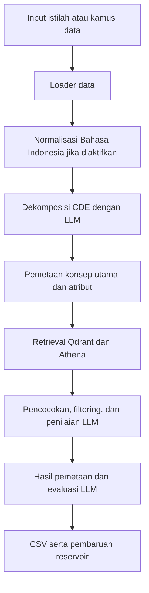

# Penjelasan Struktur Proyek CDE-Mapper dan Proposal Disertasi

Tanggal penyusunan: 15 September 2026.

## 1. Ruang Lingkup Pembacaan

Dokumen ini merangkum pembacaan struktur proyek, kode utama, laporan penelitian, dan dokumen LaTeX `V4-Disertasi Anie/Proposal Disertasi-Anie Rose Irawati.tex` beserta berkas bab yang dipanggilnya.

Penjelasan didasarkan pada kode dan dokumen lokal. Inferensi, pengujian, dan kompilasi LaTeX tidak dijalankan dalam kegiatan pembacaan ini. Angka eksperimen merupakan hasil yang dicatat dalam laporan tersimpan, bukan hasil pengujian ulang. Status checkpoint juga merujuk pada artefak audit tersimpan.

## 2. Gambaran Besar

CDE-Mapper di workspace ini merupakan proyek riset pemetaan istilah klinis yang sedang dikembangkan untuk menangani teks panjang berbahasa Indonesia. Terdapat tiga lapisan utama:

1. **Mesin dasar CDE-Mapper**, untuk memetakan elemen data klinis ke konsep terminologi standar.
2. **Adaptasi Bahasa Indonesia**, berupa normalisasi, persiapan ekstraksi entitas, dataset, dan eksperimen.
3. **Dokumen disertasi**, yang menjelaskan landasan ilmiah, arsitektur usulan, dan rancangan evaluasi.

Repository ini sekaligus menjadi tempat kode aplikasi, eksperimen penelitian, dan penulisan disertasi.

## 3. Struktur dan Fungsi Folder

| Bagian | Fungsi |
|---|---|
| `run.py` | Titik masuk program pemetaan melalui command line. |
| `rag/` | Mesin utama: pemuatan data, embedding, retrieval, dekomposisi kueri, penilaian LLM, dan penyimpanan pemetaan. |
| `data/` | Input, gold standard, dataset evaluasi, hasil pemetaan, dan hasil eksperimen. |
| `example_selector/` | Indeks FAISS untuk pemilihan contoh dekomposisi, ranking, dan prediksi hubungan. |
| `configs/` | Konfigurasi dan artefak reproduksibilitas baseline. |
| `scripts/` | Runner eksperimen, normalisasi, audit, dan pencatatan environment. |
| `evaluation/` | Perhitungan metrik retrieval, mapping, dan pengujian statistik. |
| `tests/` | Pengujian normalisasi Bahasa Indonesia dan skema entitas. |
| `resources/` | Sumber daya model dan log. |
| `Riset/` | Rencana implementasi, laporan, korpus, checkpoint, dan layanan Athena lokal. |
| `V4-Disertasi Anie/` | Dokumen utama LaTeX, isi bab, referensi, dan gambar proposal. |
| `variables.db` | SQLite untuk menyimpan pemetaan yang dapat digunakan kembali, disebut knowledge reservoir. |

## 4. Cara Kerja Implementasi CDE-Mapper

Alur utama pada [run.py](../run.py) dapat diringkas sebagai berikut:



Diagram tersebut menyederhanakan alur utama; detail pencarian dan penggunaan reservoir berada pada fungsi pemetaan konsep dan atribut.

### 4.1 Membaca Data

[rag/data_loader.py](../rag/data_loader.py) memuat data menjadi objek yang digunakan pipeline. Untuk kamus data, informasi dapat mencakup:

- Nama dan label variabel.
- Kategori nilai.
- Satuan.
- Formula.
- Kunjungan atau waktu pengukuran.

Satu masukan dapat merepresentasikan konsep komposit, bukan hanya satu kata. Struktur data internalnya antara lain didefinisikan dalam [rag/py_model.py](../rag/py_model.py).

### 4.2 Normalisasi Bahasa Indonesia

[rag/id_preprocess.py](../rag/id_preprocess.py) menyiapkan teks melalui koreksi ejaan, ekspansi singkatan berdasarkan konteks, normalisasi satuan, dan segmentasi kalimat.

Contoh dari laporan proyek:

```text
Input:
Px dgn DM tipe 2, GDP 126 mg/dL, TD 150/90

Hasil normalisasi:
pasien dengan diabetes melitus tipe 2, gula darah puasa 126 mg/dL, tekanan darah 150/90
```

Integrasi pada program utama bersifat opsional melalui `--normalize_id`. Terdapat profil `clinical`, `question`, dan `answer`. Normalisasi pertanyaan dan jawaban konsultasi dibedakan agar pemrosesan sesuai karakter sumber teks.

Normalizer juga menyediakan jejak perubahan dan peringatan untuk kasus ambigu. Stemming Bahasa Indonesia belum diaktifkan dalam implementasi yang dibaca.

### 4.3 Dekomposisi Kueri

[rag/llm_chain.py](../rag/llm_chain.py) menggunakan LLM untuk mengurai CDE menjadi komponen seperti:

- Konsep utama atau base entity.
- Domain.
- Entitas tambahan.
- Kategori.
- Satuan.
- Metode dan kunjungan.

**Dekomposisi berbeda dari ekstraksi multi-entitas.** Dekomposisi mengurai satu CDE kompleks, sedangkan ekstraksi multi-entitas mencari banyak CDE dalam sebuah dokumen. Perbedaan ini menjadi penghubung penting antara kemampuan baseline dan tujuan adaptasi disertasi.

### 4.4 Pencarian Kandidat

Komponen retrieval menggunakan:

- **SapBERT**, untuk representasi semantik atau kemiripan makna.
- **BM42/FastEmbed**, sebagai representasi sparse pada `run.py` saat ini.
- **Qdrant**, untuk pencarian vektor.
- **Athena**, sebagai sumber pencarian konsep tambahan.

[rag/vector_index.py](../rag/vector_index.py) mengatur indeks, filter, dan penggabungan retriever. [rag/retriever.py](../rag/retriever.py) mengoordinasikan pemetaan.

Terdapat layanan **FastAPI Athena lokal** di [Riset/api-athena](api-athena/README.md). Menurut dokumentasinya, layanan ini mengambil hasil melalui endpoint CSV Athena dan menyimpan cache SQLite. Retriever utama saat ini secara default mengarah ke `http://127.0.0.1:8000/api/athena/search`, yang dapat diubah melalui `ATHENA_API_URL`.

Keberadaan konfigurasi dan kode layanan tidak membuktikan layanan sedang aktif; runtime tidak diperiksa dalam pembacaan ini.

### 4.5 Penilaian dan Penyimpanan

Kandidat menjalani pencocokan dan penilaian LLM. Hasil dapat disimpan ke CSV serta reservoir.

Tiga tempat penyimpanan berikut perlu dibedakan:

| Komponen | Informasi yang disimpan | Tujuan |
|---|---|---|
| Qdrant | Representasi konsep untuk pencarian | Mengambil kandidat terminologi. |
| Reservoir SQLite | Pasangan pemetaan | Menggunakan kembali hasil pemetaan. |
| Cache Athena | Hasil permintaan pencarian Athena | Mengurangi permintaan berulang dan menyediakan fallback cache. |

## 5. Struktur Proposal LaTeX

Berkas [Proposal Disertasi-Anie Rose Irawati.tex](../V4-Disertasi%20Anie/Proposal%20Disertasi-Anie%20Rose%20Irawati.tex) merupakan **dokumen induk**. Isinya terutama mengatur format dan memanggil berkas lain.

Urutan dokumen:

```text
metadata.tex
    ↓
Halaman judul
    ↓
pengesahan.tex
    ↓
Daftar isi, gambar, dan tabel
    ↓
glosarium.tex
    ↓
ringkasan.tex
    ↓
bab-1.tex — Pendahuluan
bab-2.tex — Tinjauan Pustaka
bab-3.tex — Landasan Teori
bab-4.tex — Metode Penelitian
    ↓
term-mapping.bib — Daftar pustaka
```

Judul dalam [metadata.tex](../V4-Disertasi%20Anie/metadata.tex):

> Adaptasi CDE-Mapper Pemetaan Terminologi Klinis untuk Teks Bahasa Indonesia: Pendekatan Berbasis LLM dan Hybrid Retrieval

Penulisnya adalah Anie Rose Irawati. Jenis dokumen aktif adalah **UJIAN KOMPREHENSIF**, meskipun nama berkas menggunakan kata Proposal.

Dokumen menggunakan kelas `report`, bahasa Indonesia, pengaturan halaman A4, spasi satu setengah, penomoran bab Romawi, serta bibliografi `apacite-dkk`. Berkas `persetujuan.tex` tersedia, tetapi pemanggilannya pada dokumen induk sedang dikomentari; yang aktif adalah `pengesahan.tex`.

### 5.1 Isi Setiap Bab

| Bab | Pokok pembahasan |
|---|---|
| I — Pendahuluan | Masalah standardisasi istilah klinis Indonesia, kebutuhan interoperabilitas, keterbatasan pendekatan sebelumnya, tujuan dan manfaat penelitian. |
| II — Tinjauan Pustaka | Perkembangan metode pemetaan, penelitian terminologi dan BioNER Indonesia, serta posisi dan kesenjangan penelitian. |
| III — Landasan Teori | Terminologi target, LLM, RAG, CDE-Mapper, dataset, dan metrik evaluasi. |
| IV — Metode Penelitian | Pipeline usulan, formula penilaian kandidat, pembangunan gold standard, baseline, ablasi, dan prosedur pengujian. |

Perubahan substansi penelitian terutama dilakukan di `bab-1.tex` hingga `bab-4.tex`. Dokumen induk mengatur penyatuan dan penyajian bagian-bagian tersebut.

## 6. Inti Penelitian yang Diusulkan

Tujuan penelitian dapat diringkas sebagai berikut:

**Mengubah teks klinis naratif berbahasa Indonesia menjadi kumpulan entitas klinis terstruktur, kemudian memetakan setiap entitas ke terminologi yang sesuai sambil mempertahankan konteksnya.**

Tiga fokus adaptasinya:

1. **Bahasa Indonesia:** singkatan, ejaan tidak baku, istilah lokal, dan campuran bahasa.
2. **Teks panjang:** satu dokumen dapat mengandung banyak entitas dan atribut.
3. **Multi-terminologi:** memilih SNOMED CT, LOINC, atau ICD-10 berdasarkan jenis informasi dan tujuan pemetaan.

Multi-terminologi dalam arsitektur ini berarti routing sesuai kebutuhan entitas. Contoh dalam proposal: diagnosis diarahkan ke SNOMED CT dan ICD-10, sedangkan pemeriksaan laboratorium diarahkan ke LOINC. Dengan demikian, tidak setiap entitas harus menghasilkan kode di ketiga terminologi.

### 6.1 Delapan Langkah Arsitektur Usulan

Arsitektur pada [Bab IV](../V4-Disertasi%20Anie/bab-4.tex) terdiri dari:

1. Pra-pemrosesan dan normalisasi bahasa.
2. Ekstraksi multi-entitas dan pembentukan JSON.
3. Penerapan aturan pemetaan dan transformasi format.
4. Dekomposisi kueri untuk setiap entitas.
5. Pemeriksaan knowledge reservoir.
6. Ensemble retrieval kandidat konsep.
7. Filtering, reranking, dan validasi keputusan.
8. Pembaruan reservoir dan penyusunan keluaran.

Sebagai ilustrasi, satu teks yang menyebut diagnosis, pemeriksaan glukosa, dan tekanan darah akan menghasilkan beberapa entitas. Setiap entitas kemudian memiliki proses pemetaan sendiri, dengan hubungan ke dokumen sumber tetap dipertahankan.

### 6.2 Penilaian Kandidat dan Abstain

Proposal merancang skor akhir yang menggabungkan:

- Kecocokan leksikal.
- Kecocokan semantik.
- Kesesuaian domain.
- Kelengkapan atribut.
- Kesesuaian granularitas atau tingkat kekhususan konsep.
- Konsistensi keputusan LLM.

Bobot dan ambang direncanakan dipilih menggunakan data pengembangan. Kandidat yang tidak memenuhi ambang menghasilkan **abstain**, yaitu sistem menahan keputusan untuk ditinjau ahli.

Formula tersebut dinyatakan dalam proposal sebagai operasionalisasi model usulan, bukan formula asli CDE-Mapper. Keberadaannya dalam proposal belum berarti seluruh komponen skor telah diimplementasikan pada program utama.

### 6.3 Rancangan Evaluasi

Proposal membedakan evaluasi pemetaan istilah pendek dari evaluasi pipeline lengkap pada teks panjang. Pemisahan ini membantu membedakan kesalahan ekstraksi dari kesalahan pemetaan.

Pembanding yang direncanakan meliputi pencocokan leksikal, LLM zero-shot tanpa RAG, dan CDE-Mapper asli. Pengujian ablasi menonaktifkan komponen tertentu untuk mengukur kontribusinya.

Data pengembangan digunakan untuk menyetel prompt, bobot, aturan, dan ambang. Data uji dipisahkan dari proses tersebut. Gold standard direncanakan melalui anotasi ahli dan adjudikasi perbedaan anotasi.

## 7. Status Implementasi yang Terlihat

**Rancangan proposal lebih luas daripada pipeline yang sudah terintegrasi saat ini.**

| Komponen | Bukti atau status yang ditemukan |
|---|---|
| Baseline CDE-Mapper | Kode, runner eksperimen, dan laporan hasil tersedia. |
| Normalisasi Indonesia | Sudah diimplementasikan dan terhubung ke `run.py`. |
| Pengolahan korpus Alodokter | Laporan mencatat normalisasi 150 pasangan konsultasi. |
| Skema ekstraksi entitas | Tersedia di `rag/id_entity_schema.py`, termasuk validasi struktur dan konteks. |
| Persiapan gold set ekstraksi | Tersedia 40 tugas untuk dua anotator. |
| Anotasi gold set | Audit tersimpan menyatakan `pending_annotation`; belum ada tugas selesai pada kedua anotator. |
| Ekstraksi teks panjang hingga mapping lengkap | Belum terlihat sebagai alur lengkap yang terintegrasi dalam `run.py` yang dibaca. |

### 7.1 Normalisasi

[Laporan Tahap 1](LAPORAN_TAHAP_1_NORMALISASI.md) mencatat implementasi normalisasi deterministik, profil pertanyaan dan jawaban, segmentasi, penandaan boilerplate, serta jejak perubahan.

Laporan mencatat hasil exact normalized match 5/5 pada gold kecil dan keberhasilan pemrosesan 150 pasangan konsultasi. Ukuran gold tersebut belum memadai untuk dianggap sebagai evaluasi final penelitian.

### 7.2 Skema Entitas dan Gold Set

[rag/id_entity_schema.py](../rag/id_entity_schema.py) mendefinisikan informasi seperti:

- Mention dan bentuk normalisasinya.
- Tipe entitas dan domain.
- Nilai, satuan, dosis, frekuensi, rute, dan metode.
- Assertion, termasuk status negasi atau ketidakpastian.
- Temporalitas.
- Experiencer, yaitu siapa yang mengalami kondisi.
- Epistemic status, untuk membedakan fakta, kemungkinan, atau informasi lain.
- Sumber teks dan pembicara.
- Posisi karakter, kalimat, bukti, dan confidence.

Informasi tersebut diperlukan agar kalimat seperti “ibu pasien mengalami diabetes” tidak dianggap sebagai diagnosis pasien. Demikian pula, diagnosis banding dalam jawaban dokter tidak otomatis menjadi fakta pasien.

[Audit Checkpoint 3](Tahap_2/checkpoint_03/stage2_checkpoint_03_audit.json) bertanggal 25 Juli 2026 mencatat:

- Tugas yang diharapkan: 40.
- Anotasi selesai oleh anotator A: 0.
- Anotasi selesai oleh anotator B: 0.
- Status gold: `not_created_pending_clinical_adjudication`.

Nilai agreement masih `null` karena belum ada pasangan anotasi lengkap yang dapat dibandingkan. Nilai tersebut bukan agreement nol. Status ini adalah status artefak audit tersimpan, bukan hasil audit ulang pada tanggal penyusunan dokumen.

### 7.3 Hasil Baseline yang Terdokumentasi

[Laporan baseline](LAPORAN_BASELINE.md) mencatat hasil berikut:

| Metrik | Retrieval hybrid | Setelah reranking Gemma |
|---|---:|---:|
| Accuracy@1 | 0,60 | 0,40 |
| Accuracy@5 | 0,70 | 0,80 |
| Accuracy@10 | 0,90 | 0,90 |
| MRR | 0,64 | 0,5843 |

Pada eksperimen kecil tersebut, reranking memperbaiki sebagian posisi kandidat, tetapi menurunkan ketepatan kandidat pertama. Reranking belum dapat diasumsikan selalu meningkatkan hasil.

Laporan membatasi interpretasinya karena evaluasi hanya menggunakan 10 kueri dan gold berasal dari template baseline yang juga terkait reservoir atau contoh pemetaan. Hasil tersebut merupakan benchmark internal untuk reproduksibilitas, belum bukti performa akhir penelitian Bahasa Indonesia.

Laporan baseline juga mencatat kegagalan Athena dengan HTTP 403 pada eksperimen tersebut. Kode saat ini sudah memiliki adapter Athena lokal; hasil historis tersebut tidak menetapkan status layanan lokal sekarang.

## 8. Perbedaan Penting antara Proposal dan Kode

| Aspek | Proposal atau dokumentasi | Implementasi atau kondisi yang terlihat |
|---|---|---|
| Sparse retrieval | Menggunakan SPLADE. | `run.py` menggunakan BM42/FastEmbed. |
| Stemming | Dicantumkan dalam preprocessing dan ablasi. | Normalizer belum mengaktifkan stemming. |
| Validasi reservoir | Pemetaan disimpan setelah validasi ahli. | Kode dapat menyimpan hasil ketika evaluator LLM memberikan label `correct`. |
| Ekstraksi multi-entitas | Bagian utama pipeline teks panjang. | Skema dan persiapan anotasi tersedia; integrasi lengkap pada `run.py` belum terlihat. |
| Definisi ablasi | Uraian awal Bab IV menyebut varian tanpa SapBERT/cross-encoder. | Bagian rancangan pengujian merinci lima varian berbeda; daftar perlu diselaraskan. |
| Lokasi workspace | Beberapa instruksi memakai `D:\Program\cde_mapper`. | Workspace yang dibaca berada di `D:\Backup LOQ\Program\cde_mapper`. |
| Nama dokumen induk | README LaTeX masih menyebut `Proposal Disertasi.tex`. | Dokumen aktif bernama `Proposal Disertasi-Anie Rose Irawati.tex`. |
| Dukungan sitasi | Bab I memiliki penanda `TODO-SITASI-TAMBAHAN`. | Beberapa klaim masih ditandai membutuhkan referensi yang tepat. |

Perbedaan reservoir dapat dilihat pada [rag/retriever.py](../rag/retriever.py) dan [rag/evalmap.py](../rag/evalmap.py): hasil evaluasi LLM digunakan untuk menentukan label `prediction`, kemudian hasil berlabel `correct` dapat dimasukkan ke reservoir. Evaluasi otomatis tersebut belum setara dengan validasi ahli yang direncanakan dalam proposal.

## 9. Kesimpulan dan Arah Pekerjaan Berikutnya

Fondasi pemetaan dan normalisasi sudah tersedia. Pekerjaan inti berikutnya adalah menyelesaikan gold standard, membangun serta mengevaluasi ekstraksi multi-entitas, lalu menghubungkannya ke pemetaan dengan konteks tetap terjaga.

Kontribusi disertasi yang paling jelas adalah adaptasi dari **CDE per masukan menjadi banyak entitas dari teks Indonesia**, disertai pemilihan terminologi, penanganan konteks, dan evaluasi yang memisahkan kualitas ekstraksi dari kualitas pemetaan.

Urutan pekerjaan yang selaras dengan artefak saat ini:

1. Menyelesaikan anotasi independen dan adjudikasi gold set ekstraksi.
2. Mengevaluasi ekstraksi span entitas dan atribut konteks.
3. Menyiapkan adapter dari entitas hasil ekstraksi ke masukan pemetaan baseline.
4. Menyelaraskan pilihan retrieval, aturan reservoir, dan rancangan ablasi antara kode dan proposal.
5. Menjalankan evaluasi pemetaan dan evaluasi end-to-end pada data uji yang terpisah dari contoh pengembangan dan reservoir.

## 10. Berkas Rujukan Utama

- [README proyek](../README.md)
- [Program utama](../run.py)
- [Orkestrasi pemetaan](../rag/retriever.py)
- [Indeks dan konfigurasi retriever](../rag/vector_index.py)
- [Dekomposisi dan penilaian LLM](../rag/llm_chain.py)
- [Normalisasi Bahasa Indonesia](../rag/id_preprocess.py)
- [Skema entitas klinis](../rag/id_entity_schema.py)
- [Reservoir SQLite](../rag/sql.py)
- [Konfigurasi baseline](../configs/baseline.yaml)
- [Laporan baseline](LAPORAN_BASELINE.md)
- [Laporan normalisasi](LAPORAN_TAHAP_1_NORMALISASI.md)
- [Rencana checkpoint Tahap 2](CHECKPOINT_IMPLEMENTASI_TAHAP_2.md)
- [Persiapan gold set](Tahap_2/checkpoint_03/README.md)
- [Layanan Athena lokal](api-athena/README.md)
- [Dokumen induk proposal](../V4-Disertasi%20Anie/Proposal%20Disertasi-Anie%20Rose%20Irawati.tex)
- [Bab I — Pendahuluan](../V4-Disertasi%20Anie/bab-1.tex)
- [Bab II — Tinjauan Pustaka](../V4-Disertasi%20Anie/bab-2.tex)
- [Bab III — Landasan Teori](../V4-Disertasi%20Anie/bab-3.tex)
- [Bab IV — Metode Penelitian](../V4-Disertasi%20Anie/bab-4.tex)

## 11. Ide Revisi Bab II dan Bab III agar Lebih Ringkas

Bagian ini merupakan usulan penyuntingan berdasarkan pembacaan Bab II dan Bab III. Usulan belum diterapkan pada berkas LaTeX.

**Bab II disarankan disusun berdasarkan masalah dan komponen riset, sedangkan Bab III hanya memuat teori yang digunakan dalam pipeline.** Pemangkasan sekaligus perlu memperjelas alasan setiap komponen penelitian diperlukan.

Sumber kepanjangan utama adalah pengulangan konteks FHIR/SATUSEHAT dan fungsi terminologi, uraian penelitian satu per satu yang diulang dalam tabel, pembahasan perkembangan umum LLM dan RAG, detail LLaMA, serta pengulangan temuan CDE-Mapper dan metrik.

### 11.1 Pembagian Fungsi Antarbab

| Bab | Pertanyaan yang dijawab |
|---|---|
| Bab I | Mengapa masalah ini penting dan apa tujuan penelitian? |
| Bab II | Apa yang sudah dilakukan penelitian lain, apa keterbatasannya, dan di mana posisi penelitian ini? |
| Bab III | Konsep dan mekanisme apa yang menjadi dasar metode? |
| Bab IV | Bagaimana metode diadaptasi, diimplementasikan, dan diuji? |

Hasil penelitian terdahulu ditempatkan di Bab II, mekanisme dasarnya di Bab III, dan pilihan operasional penelitian di Bab IV.

### 11.2 Usulan Revisi Bab II

#### Struktur yang disarankan

```text
BAB II TINJAUAN PUSTAKA

2.1 Pemetaan Terminologi Klinis
    Sintesis pendekatan leksikal, berbasis representasi, dan LLM–RAG.

2.2 Ekstraksi Entitas dan Adaptasi Bahasa Klinis
    Ekstraksi multi-entitas, konteks klinis, bahasa non-Inggris,
    dan penelitian Bahasa Indonesia.

2.3 CDE-Mapper sebagai Dasar Pengembangan
    Kemampuan, temuan utama, dan batas penerapannya.

2.4 Sintesis Kesenjangan dan Posisi Penelitian
    Matriks studi terpilih serta hubungan gap dengan komponen usulan.
```

#### Perubahan konkret

| Bagian sekarang | Usulan revisi |
|---|---|
| FHIR dan Clinical Terminology Mapping | Padatkan menjadi 1–2 paragraf pengantar; konteks nasional sudah dijelaskan di Bab I. |
| Daftar keluarga ICD dan terminologi lain | Hapus rincian di luar lingkup tiga terminologi target. |
| Evolusi Metode dan tabel periodisasi | Ganti dengan sintesis kelompok metode; urutan tahun tidak perlu menjadi kerangka utama. |
| Uraian panjang setiap penelitian | Kelompokkan beberapa penelitian dalam satu paragraf analitis. |
| Knowledge graph dan harmonisasi model data | Ringkas pada temuan yang mendukung pencarian konsep atau struktur semantik. |
| Tabel perbandingan metode dan tabel kuantitatif | Gabungkan menjadi satu matriks studi terpilih; pertahankan angka untuk studi paling relevan. |
| Penelitian di Indonesia | Pertahankan bukti tentang karakter bahasa, keterbatasan korpus, normalisasi, dan ekstraksi entitas. |
| Research Gaps yang berulang dalam narasi dan tabel | Gunakan satu tabel gap dan satu paragraf sintesis. |
| Relevansi Judul Penelitian | Gabungkan menjadi paragraf penutup posisi penelitian. |

#### Pola penulisan tinjauan pustaka

Gunakan pola **kemampuan kelompok metode → keterbatasan → implikasi bagi penelitian**.

Contoh bentuk paragraf:

> Pendekatan leksikal dan berbasis aturan memberikan pemetaan yang transparan, tetapi bergantung pada cakupan sinonim dan aturan normalisasi. Pendekatan representasi semantik memperluas pencocokan terhadap variasi istilah, sementara ketepatan konteks dan atribut tetap perlu diperiksa. Temuan tersebut mendasari penggunaan normalisasi Bahasa Indonesia, hybrid retrieval, dan penyaringan kandidat dalam penelitian ini.

Contoh tersebut menunjukkan bentuk sintesis. Saat dimasukkan ke proposal, sitasi studi pendukung harus ditempatkan pada klaim masing-masing. Detail dataset, arsitektur, dan angka setiap studi tidak perlu seluruhnya diulang dalam narasi.

#### Matriks studi terpilih

Pilih sekitar **8–12 studi inti** berdasarkan keterkaitannya dengan metode, dengan kolom:

| Studi | Input/bahasa | Pendekatan dan target | Keterbatasan | Implikasi bagi riset |
|---|---|---|---|---|
| Studi terpilih | Bentuk input dan bahasa yang diuji | Metode dan terminologi target | Batas bukti atau kemampuan | Komponen usulan yang didukung |

Studi lain tetap dapat disitasi secara kelompok. Angka performa lintas studi perlu disertai konteks dataset dan tugas agar tidak terbaca sebagai perbandingan langsung.

Bukti kebutuhan adaptasi Bahasa Indonesia, ekstraksi multi-entitas, dan pemetaan berdasarkan domain harus dipertahankan. Karena baseline sudah mendukung banyak kosakata, kontribusi multi-terminologi perlu dijelaskan lebih spesifik daripada sekadar mendukung tiga standar.

### 11.3 Usulan Revisi Bab III

Peluang pemangkasan terbesar berada pada bagian LLM dan arsitekturnya. Saat pembacaan, terdapat empat tabel LLaMA: data pretraining, perubahan arsitektur, hiperparameter, dan benchmark umum. Detail tersebut tidak langsung menjelaskan proses pemetaan yang diusulkan.

#### Struktur yang disarankan

```text
BAB III LANDASAN TEORI

3.1 Representasi Konsep dan Terminologi Klinis
    CDE atomik/komposit, konsep, atribut, domain,
    serta fungsi SNOMED CT, LOINC, dan ICD-10.

3.2 Normalisasi dan Ekstraksi Entitas Klinis
    Variasi bahasa, segmentasi, ekstraksi multi-entitas,
    negasi, temporalitas, dan experiencer.

3.3 LLM untuk Ekstraksi dan Dekomposisi Kueri
    In-context learning, few-shot, keluaran terstruktur,
    dan pemecahan CDE menjadi subkueri.

3.4 RAG dan Hybrid Retrieval
    Sparse retrieval, dense retrieval, penggabungan kandidat,
    routing, dan filtering.

3.5 Reranking, Validasi, dan Knowledge Reservoir
    Relevansi kandidat, self-consistency, abstain,
    dan penggunaan kembali pemetaan tervalidasi.

3.6 Prinsip Evaluasi
    Evaluasi ekstraksi, retrieval, mapping, dan efisiensi.
```

Struktur ini mengikuti urutan pemrosesan pada Bab IV. Normalisasi dan ekstraksi mendapat ruang yang lebih jelas karena merupakan bagian penting adaptasi.

#### Bagian yang dipadatkan atau dihapus

| Bagian sekarang | Usulan |
|---|---|
| Uraian panjang klasifikasi, terminologi, nomenklatur | Ringkas menjadi definisi kerja dan satu tabel fungsi terminologi target. |
| Evolusi LLM dan gambarnya | Hapus sebagai subbab tersendiri; cukup pengantar singkat. |
| Transformer, BERT, GPT, T5, LLaMA secara terpisah | Gabungkan menjadi penjelasan singkat peran encoder untuk representasi dan model generatif untuk ekstraksi/dekomposisi. |
| Empat tabel LLaMA | Hapus dari naskah utama. |
| Optimizer, data pretraining, GPU, dan benchmark umum LLaMA | Hapus; konfigurasi model yang benar-benar dipakai dicatat di Bab IV. |
| Evolusi RAG dan gambarnya | Ringkas menjadi satu paragraf tentang komponen yang relevan. |
| Logits-based fusion dan latent fusion | Hapus jika tidak digunakan atau dibandingkan dalam penelitian. |
| Temuan Utama Gilani | Pindahkan sintesisnya ke Bab II. |
| Uraian enam komponen CDE-Mapper yang panjang | Pertahankan satu gambar baseline dan penjelasan singkat; mekanismenya dijelaskan pada subbab terkait. |
| Klasifikasi dataset berdasarkan akses | Ringkas; sumber data yang dipilih dan pembagiannya dijelaskan di Bab IV. |
| Delapan subbagian metrik | Gabungkan menjadi tabel metrik per tahap dan beberapa formula inti. |

#### Teori yang tetap dipertahankan

- Perbedaan ekstraksi entitas dan dekomposisi CDE.
- Alasan atribut klinis harus dipertahankan.
- Fungsi routing untuk membatasi terminologi target.
- Perbedaan sparse dan dense retrieval.
- Alasan kandidat perlu difilter dan dinilai ulang.
- Perbedaan konsistensi LLM, kebenaran pemetaan, dan kesepakatan anotator.
- Peran abstain dan validasi ahli.
- Risiko kesalahan ekstraksi yang diteruskan ke pemetaan.

### 11.4 Menjaga Keselarasan Bab II, Bab III, dan Bab IV

Tabel berikut dapat menjadi pedoman penyuntingan tanpa harus ditambahkan ke naskah proposal:

| Tahap riset | Bukti di Bab II | Dasar di Bab III | Rincian di Bab IV |
|---|---|---|---|
| Normalisasi | Variasi istilah dan bahasa lokal | Normalisasi dan preservasi informasi | Kamus, aturan, profil pemrosesan |
| Ekstraksi | Keterbatasan pemrosesan naratif | Entitas, span, dan konteks | Skema JSON, chunking, model |
| Routing dan dekomposisi | Keterbatasan pemetaan komposit/lintas target | Domain, atribut, subkueri | Aturan target dan transformasi |
| Retrieval | Temuan metode leksikal dan semantik | Sparse, dense, dan fusion | Model, indeks, bobot, Top-k |
| Reranking dan validasi | Keterbatasan relevansi dan ketidakpastian | Penilaian, konsistensi, abstain | Skor akhir dan ambang |
| Reservoir | Temuan penggunaan kembali pemetaan | Cache dan validasi | Kebijakan penyimpanan dan eksperimen |
| Evaluasi | Keterbatasan evaluasi studi terdahulu | Definisi metrik | Gold set, baseline, ablasi |

Setiap komponen Bab IV dengan demikian memiliki alasan empiris di Bab II dan dasar konseptual di Bab III.

### 11.5 Peringkasan Formula, Gambar, dan Metrik

#### Formula

Pertahankan formula yang membantu membaca metode: similarity, sparse score, hybrid retrieval, serta metrik inti.

Formula khusus model usulan—skor atribut, granularitas, agregasi enam komponen, dan keputusan penerimaan—tetap berada di Bab IV. Hindari menjelaskannya dua kali. Saat memindahkan atau menghapus formula, periksa label dan referensi silang agar rujukan Bab IV tetap valid.

#### Metrik

| Tahap | Metrik utama |
|---|---|
| Ekstraksi | Precision, recall, F1 pada span entitas |
| Atribut konteks | Macro-F1 atau accuracy per atribut |
| Retrieval | Recall@k dan MRR |
| Mapping | Accuracy@1 dan ketepatan per terminologi |
| Abstain | Coverage keputusan dan akurasi hasil yang diterima |
| Efisiensi | Latensi, penggunaan token, dan cache hit |

Coverage kandidat dan coverage keputusan akhir perlu dibedakan karena mengukur hal berbeda. Bab III menjelaskan definisi dan unit evaluasi; Bab IV menjelaskan penerapan metrik pada eksperimen.

#### Gambar dan tabel

Prioritaskan satu gambar CDE-Mapper baseline di Bab III, lalu gunakan gambar arsitektur adaptasi di Bab IV. Gambar evolusi LLM, Transformer umum, dan evolusi RAG dapat dihapus.

Setelah isi dipadatkan, tinjau penggunaan penempatan gambar/tabel `[H]` yang dapat menyebabkan ruang kosong. Ukuran huruf, margin, dan spasi tetap mengikuti ketentuan disertasi.

### 11.6 Target Panjang dan Prioritas Penyuntingan

Sebagai **anggaran penyuntingan**, bukan hasil pengukuran PDF:

- Bab II: sekitar **7–9 halaman**.
- Bab III: sekitar **8–10 halaman**.

Jumlah akhirnya perlu diperiksa setelah kompilasi dan disesuaikan dengan ketentuan kampus. Belum ada pengukuran pengurangan halaman aktual dalam usulan ini.

Urutan prioritas:

1. Hapus rincian LLaMA dan pembahasan evolusi umum yang tidak digunakan dalam metode.
2. Gabungkan tabel tinjauan pustaka dan ubah uraian per studi menjadi sintesis tematik.
3. Hilangkan pengulangan FHIR, terminologi, hasil CDE-Mapper, dan metrik antarbab.
4. Susun landasan teori mengikuti pipeline normalisasi, ekstraksi, routing/dekomposisi, retrieval, reranking/validasi, dan reservoir.
5. Periksa kesinambungan gap, dasar teori, dan metode; pertahankan sitasi yang mendukung klaim penting.
6. Periksa referensi silang dan kompilasi untuk menilai panjang serta tata letak akhir.

**Inti revisi adalah mengurangi materi umum dan pengulangan, sambil mempertahankan hubungan research gap → dasar teori → metode usulan.**
